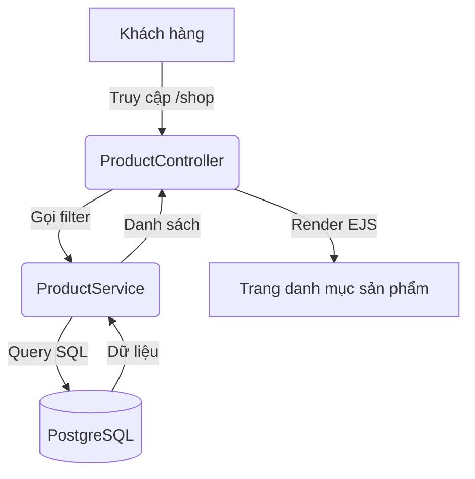

# Thiết kế Hệ thống (System Design): GreenLife

## 1. Kiến trúc Hệ thống (System Architecture)
Hệ thống sử dụng kiến trúc **Monolithic SSR (Server-Side Rendering)**.
- **Pattern:** MVC + Service Layer.
- **Khối xử lý:**
    - **Frontend (View):** EJS Templates + TailwindCSS.
    - **Logic (Service):** Xử lý nghiệp vụ tập trung, không phụ thuộc vào Transport Layer (Web/CLI).
    - **Data (Persistence):** PostgreSQL qua Sequelize ORM.

## 2. Thiết kế Dữ liệu (Data Modeling)

### 2.1. Sơ đồ Thực thể chi tiết (ERD)
| Thực thể | Thuộc tính chính | Quan hệ |
| :--- | :--- | :--- |
| **Users** | `id, name, email (unique), password (hash), role` | 1-N với Orders |
| **Products** | `id, name, slug (unique), price, stock, light_level, water_level` | N-N với Categories, 1-1 với CareGuides |
| **Categories** | `id, name, slug` | N-N với Products |
| **Orders** | `id, user_id, total_price, status, shipping_address` | N-M với Products (qua OrderItems) |
| **OrderItems** | `id, order_id, product_id, quantity, unit_price` | Bảng trung gian lưu snapshot giá |
| **CareGuides** | `id, product_id, markdown_content` | 1-1 với Products |

### 2.2. Logic phân loại & Lọc (Business Logic Design)
- **Light/Water Levels:** Lưu dưới dạng Integer (1-3) đại diện cho (Thấp, Trung bình, Cao) để dễ dàng thực hiện câu lệnh `WHERE ... <= 2`.
- **Slugs:** Tự động tạo từ tên sản phẩm để tối ưu SEO URL (ví dụ: `cay-luoi-ho-vang`).

## 3. Luồng Hệ thống (System Flows)

## 4. Chiến lược Bảo mật & Xác thực
- **Xác thực:** Passport.js (Local Strategy) sử dụng Session lưu trong Memory/Redis.
- **Phân quyền:** RBAC (Role-Based Access Control) đơn giản với 2 role: `admin`, `customer`.
- **Dữ liệu:** Bcrypt cho mật khẩu, SQL Injection protection qua Sequelize.
